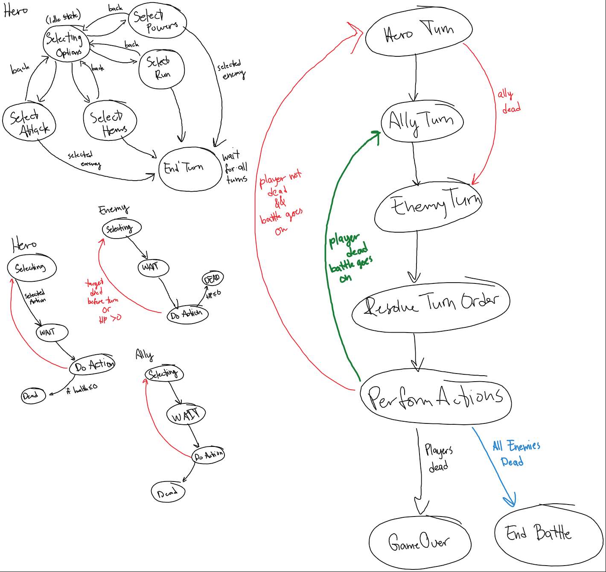

# Battle-Simulation
Simulates a turn based battle in Unity. Much like the first few installments of the Final Fantasy Series. WIP

## Table of Contents
* [Purpose](#purpose)
* [Technologies Used](#technologies-used)
* [Setup](#setup)
* [Functional Requirements](#functional-requirements)
* [Pseudocode](#pseudocode)
* [State Machine Idea](#state-machine-idea)
* [Ideas To Implement](#ideas-to-implement)

## Purpose
Trying to utilize state machines, inheritance, SOLID design principles.

Also wanted to learn about the UnityEngine.

## Technologies Used
C#, Unity

## Setup
Working on it

## Functional Requirements
#### What I want to implement
- Player and Ally exist
- Enemies exist
- User has options during battle through player and ally
  - Attack
    - Attack one monster
    - Combo attack
  - Items
    - Drink potion to heal or gain mana
    - Use reviving item
  - Powers
    - Fireball
    - Lightning bolt
    - Water spray
    - Combine powers
  - Run
    - Will end fight if roll success
- Enemies can attack back

## Pseudocode
```
Player turn
• Choose attack option for Hero
	○ If attack
		§ If back
			□ go back to action options
		§ choose enemy to attack
		§ ally turn
	○ If powers
		§ If back
			□ go back to action options
		§ choose power to use
			□ choose enemy to attack
		§ Ally turn
	○ If items
		§ if back
			□ go back to action options
		§ Choose item to use
			□ choose actor to use item on
		§ Ally turn
	○ If run
		§ Ally turn
• Choose action option for Ally
	○ If attack
		§ go back option
		§ choose enemy to attack
			□ If enemy is same as hero target
				® Option to combine attacks
		§ End turn
	○ If powers
		§ Go back option
		§ Choose power to use
			□ If enemy is same hero as target
				® Option to combine attacks
		§ End turn
	○ If items
		§ Go back option
		§ Choose item to use
			□ Choose actor to use item on
		§ End turn
	○ If run
		§ End turn
Monster turn
• Choose random target, or maybe low health
Resolve who goes first
• Speed based
Deal damage
Check deaths
• If all enemies dead
	○ Give loot to players
	○ End battle
• If player and ally dead
	○ Game over
• If player dead
	○ Ally can revive if able
• If ally dead
	○ Player can revive if able
Repeat
```

## State Machine Idea


## Ideas to Implement
- Weapon and Armor equipping for player and ally
- Retuning stats for each actor
- Add "path" for encounters - user has to fight a series of predetermined battles
- Adding sprites, animation
- More ideas as project progresses...
